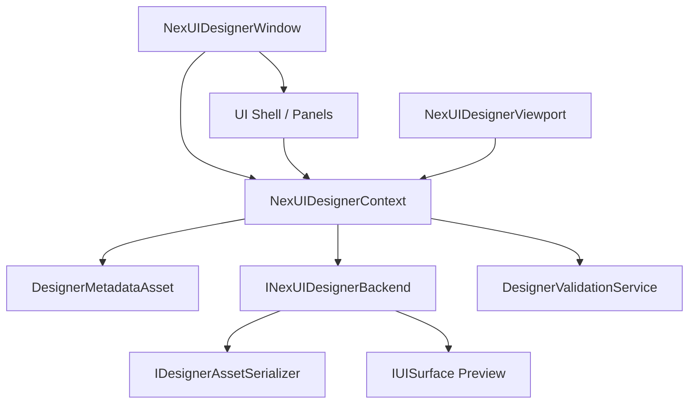
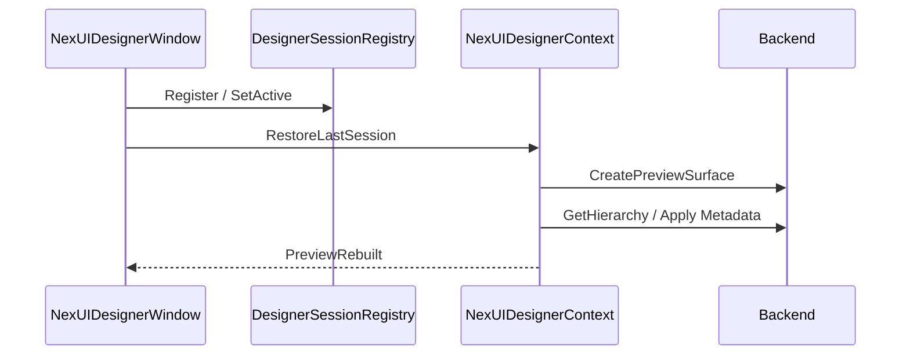
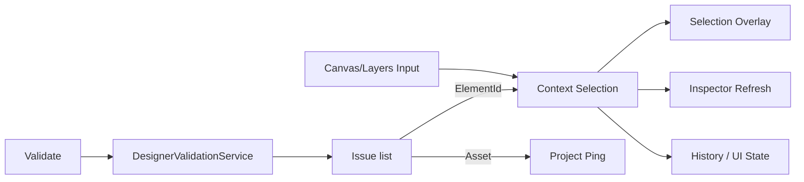
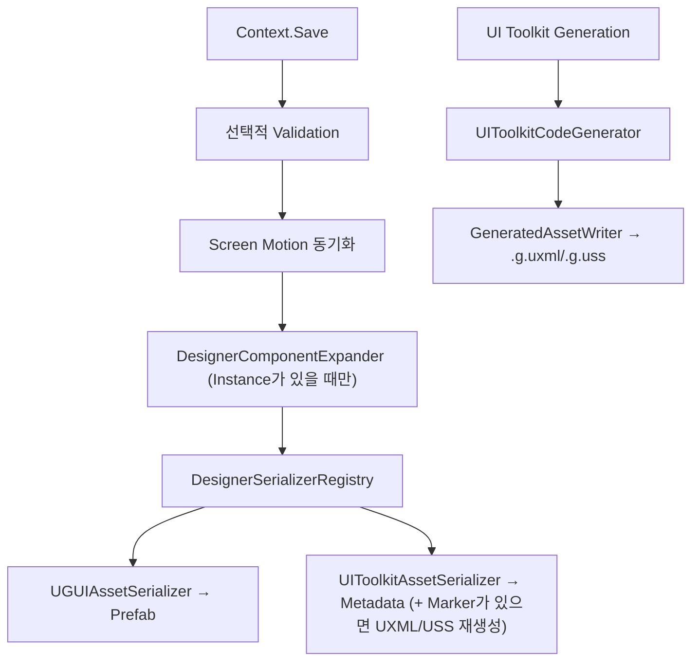

# NexUI Studio 아키텍처

**대상:** Studio를 유지보수하거나 확장하는 개발자  
**경계:** `Runtime/`은 `UnityEditor`를 참조하지 않으며, Editor Window·AssetDatabase·Undo는 `Editor/`에만 둡니다.



## Studio Session

`DesignerSessionRegistry`가 열린 `NexUIDesignerWindow`와 Context를 등록합니다. 포커스를 받은 창이 Active가 되며 Satellite Window는 `DesignerSessions.ActiveContext`만 사용합니다. `IDesignerSessionProvider`를 교체할 수 있어 테스트나 외부 통합에서 Context를 주입할 수 있습니다.

## UI 수명주기

Context 이벤트를 사용하는 VisualElement는 `ContextBoundSubscriptions`에 handler를 등록합니다. Panel Attach에서 한 번 Subscribe하고 Detach에서 동일 delegate를 Unsubscribe합니다. Studio UI를 Rebuild해도 이전 VisualElement가 Context에 남지 않습니다.

## 저장 데이터

```text
UIScreenDefinition
├─ Backend Asset
├─ Screen 정책
└─ UIScreenMotionConfig (진입/종료 Runtime 참조)

DesignerMetadataAsset
├─ Elements / Parent / Binding
│  └─ componentInstance (Definition 참조 + Override + Variant 선택)
├─ Screen Motion
│  ├─ Entry / Exit Clip
│  ├─ Element Trigger Bindings
│  ├─ Reduced Motion Clip
│  ├─ Motion State Machine
│  └─ Motion Graph
└─ Companion JSON

DesignerComponentDefinitionAsset   (별도 에셋)
├─ Elements (sub-tree)
├─ Exposed Properties / Slots
└─ Variant Properties / Rules
```

Motion Clip 자체는 `UIMotionClip` 에셋이며 Metadata에는 참조만 저장합니다. 마찬가지로 Component Instance도 Definition의 element를 복제하지 않고 참조만 저장합니다.

## 생성과 Publish

`UIToolkitCodeGenerator`는 문자열만 생성합니다. `GeneratedAssetWriter`가 경로/Marker/최소 문법을 검증하고 UXML/USS를 임시 파일에 모두 쓴 뒤 교체합니다. 실패하면 기존 파일을 복원하며 변경된 에셋만 Import합니다.

## 초기화와 Rebuild



## Selection과 Validation



## Save와 Backend 분기



## Authored와 Expanded의 분리

재사용 Component가 도입되면서 **사용자가 편집하는 트리**와 **Backend가 받는 트리**가 갈라졌습니다.

```text
Authored Metadata   ← 선택·드래그·Inspector·Undo·Companion JSON의 대상
      │
      │ DesignerComponentExpander.Expand(asset, resolver)
      ▼
Expanded Metadata   ← Canvas 렌더, Serializer, Save Preview, Validation의 대상
                      HideFlags.HideAndDontSave인 메모리 전용 사본
```

지켜야 할 규칙:

* Expanded 사본은 **절대 디스크에 쓰지 않습니다.** Serializer가 `SaveAssetIfDirty`를 호출해도 사본에는 효과가 없으므로, `Context.Save`가 원본 Metadata를 따로 저장합니다.
* Instance가 없는 화면은 **복사조차 하지 않고** authored asset을 그대로 돌려줍니다(무비용 경로). 기존 동작과 완전히 동일합니다.
* Canvas는 Expanded를 그리지만 Hit Test와 선택은 authored만 대상으로 합니다. `Context.ResolveAuthoredElement`가 둘을 잇습니다.
* Expansion은 `Context`에서 캐시되며 Metadata Dirty·Undo·Metadata 교체·Definition 변경 시 무효화됩니다.

Undo는 변경 대상 Asset에 `Undo.RecordObject`를 호출한 뒤 Dirty를 표시합니다. Drag는 종료 시 한 번 Context에 Commit합니다. Context의 Undo callback이 Preview, Selection과 Validation을 다시 갱신합니다.

Figma는 별도 Editor assembly이며 Core/Studio를 변환하지 않고 API 접근만 확인합니다. Motion Clip Editor, Graph, Scenario, Screen Flow와 QA 도구는 `Editor/Advanced` 또는 `Editor/QA` 아래의 Satellite Tool입니다.
