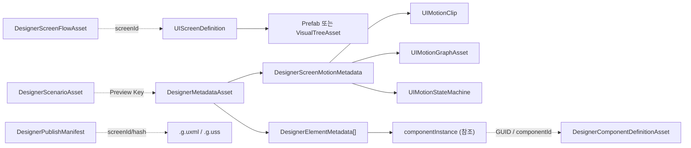

# Metadata Schema

NexUI Studio의 데이터는 Runtime 화면 정의, Studio 제작 데이터와 독립 고급 도구 Asset으로 나뉩니다. Runtime 폴더의 타입은 `UnityEditor`를 참조하지 않지만, 모든 타입이 게임 실행에 자동 사용되는 것은 아닙니다.

Component Instance는 Definition의 element를 화면에 **복사하지 않고 참조만** 저장합니다. Preview·Serializer·Validation은 `DesignerComponentExpander`가 만든 평탄화 트리를 소비하며, 이 결과는 메모리에만 존재하고 사용자 Asset에 기록되지 않습니다. 자세한 내용은 [재사용 Component](../advanced/reusable-components.md)를 참고하세요.

## 주요 타입

| 타입 | Namespace / 파일 | 책임과 주요 필드 | 수정자 | Runtime |
| --- | --- | --- | --- | --- |
| `UIScreenDefinition` | `emiteat.NexUI.Core`, Core `Runtime/Core/UIScreenDefinition.cs` | identity, backendAsset, layer, motion, policy, focus, relations, validation, variants | 사용자/Studio 연결 도구 | UIManager가 읽음 |
| `DesignerMetadataAsset` | `emiteat.NexUI.Studio`, `Runtime/Metadata/DesignerMetadataAsset.cs` | screenId, elements, screenMotion, 고급 제작 Metadata | Studio | Runtime-safe 직렬화 형식, 주 용도는 제작 |
| `DesignerElementMetadata` | 같은 Namespace, `Runtime/Metadata/DesignerElementMetadata.cs` | ID, parent/sibling/slot, rect, style, Binding, Motion, Layout, Accessibility | Studio | Backend 변환/Preview 계약 |
| `DesignerScreenMotionMetadata` | `Runtime/Metadata/DesignerScreenMotionMetadata.cs` | entry/exit Clip, Trigger Binding, State Machine, Graph 참조 | Studio/Motion Inspector | Runtime 연결 시 사용 가능 |
| `DesignerScenarioAsset` | `Runtime/Metadata/DesignerScenarioAsset.cs` | Preview Binding 값, 상태, 언어, 환경, Timeline | Scenario Editor | 실제 게임 상태에는 사용 안 함 |
| `DesignerTokenSetAsset` | `Runtime/Metadata/DesignerTokenSetAsset.cs` | Token literal/alias | Token 도구 | Element Style 직접 연결 없음 |
| `DesignerScreenFlowAsset` | `Runtime/Metadata/DesignerScreenFlowAsset.cs` | Node, Transition, 시작 Node, Guard Key | Flow Editor | UIManager 자동 연결 없음 |
| `DesignerPublishManifest` | `Runtime/Metadata/DesignerPublishManifest.cs` | Screen별 UXML/USS 마지막 Publish Hash | Publish Service | Editor 동기화 기준 |
| `DesignerComponentDefinitionAsset` | `Runtime/Metadata/DesignerComponentDefinitionAsset.cs` | 재사용 Component의 element sub-tree와 계약(Exposed Property, Slot, Variant) | Component Library / 사용자 | Instance 전개의 원본 |
| `DesignerComponentInstanceMetadata` | `Runtime/Metadata/DesignerComponentInstanceMetadata.cs` | Definition 참조, Override, Variant 선택, Detach 상태 | Studio | Element마다 존재하되 `definitionGuid`가 있을 때만 유효 |

## Motion 참조

`DesignerMotionBinding`은 `bindingId`, `targetElementId`, Trigger, 선택적인 `stateId`/`commandId`, 기본/Reduced Motion Clip 참조를 가집니다. Clip 데이터를 Metadata 안에 복제하지 않습니다. Screen 단위 Entry/Exit은 `entryClip`/`exitClip`에 저장합니다. Element ID 변경은 참조 갱신 경로를 사용해야 하며 Serialized 필드를 직접 문자열 치환하면 안 됩니다.

## Companion JSON

`DesignerMetadataJsonSerializer`는 Metadata 교환용 JSON을 처리합니다. `.asset`이 Unity 직렬화의 기준이며 JSON을 별도의 Runtime 진실 원본으로 간주하면 안 됩니다. JSON Import 전에는 대상과 Diff를 확인하세요.

## Version과 Migration

`DesignerMetadataAsset.CurrentSchemaVersion`은 현재 **4**입니다. `DesignerHierarchyMigration.Migrate`가 전진 방향으로만 마이그레이션하고, 끝나면 Version을 기록해 같은 Asset에서 두 번 실행되지 않도록 합니다.

| 단계 | 내용 | 사용자에게 보이는 변화 |
|---|---|---|
| v0 → v1 | 현재 list 순서에서 `siblingIndex` 부여 | 없음 (그리던 순서 그대로) |
| v1 → v2 | `stableId` 생성, `runtimeVisible = !hiddenInDesigner` | 없음 (v2 이전의 backend 결과 보존) |
| v2 → v3 | flat field(`tint`/`textColor`/`fontSize`/`shape`/`clipChildren`)를 typed style block으로 복사, legacy string override path를 `DesignerPropertyId`로 매핑 | 없음 (legacy 값은 지우지 않음) |
| v3 → v4 | `componentInstance` 정규화, 적용 불가능한 빈 override 제거 | 없음 (추가 전용 필드) |

모든 단계는 반복 실행에 안전하고, 대화형 경로에서는 `Undo.RecordObject`로 기록됩니다. 기존 필드 기본값은 이전 Asset을 안전하게 읽도록 설계되어 있습니다.

새 직렬화 필드를 추가할 때는 기존 Asset의 기본값, Undo/Dirty 처리, JSON Serializer, Validator, 두 Backend Serializer와 Migration을 함께 검토합니다. Runtime 타입에 `UnityEditor` 참조를 추가하지 않습니다.

## Assembly 경계

Metadata 타입은 Studio Runtime Assembly에 있습니다. Window, AssetDatabase, Undo, Serializer와 Migration은 Editor Assembly에 있습니다. Core 책임은 실행 화면 계약이고, Studio 전용 Preview/편집 책임을 Core에 넣지 않습니다.

